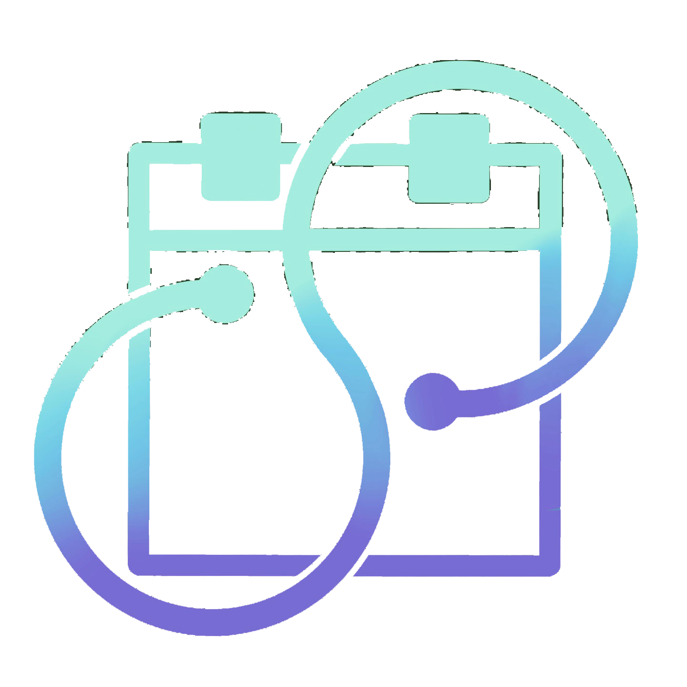
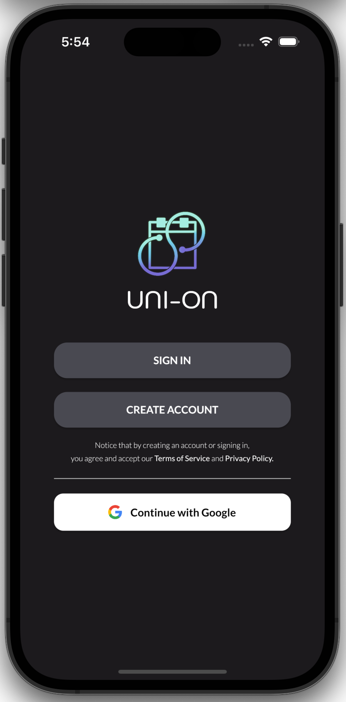
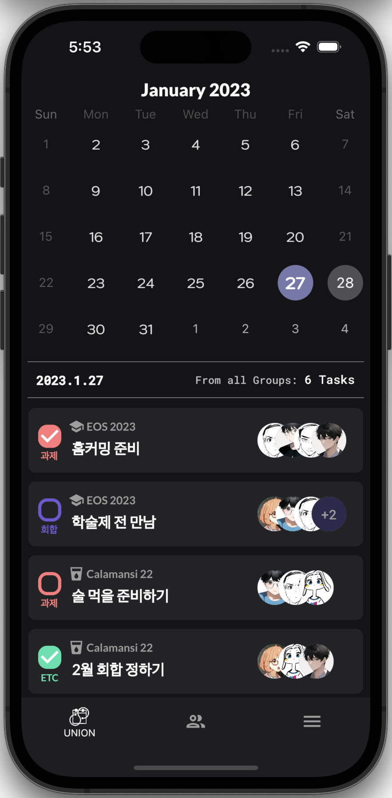
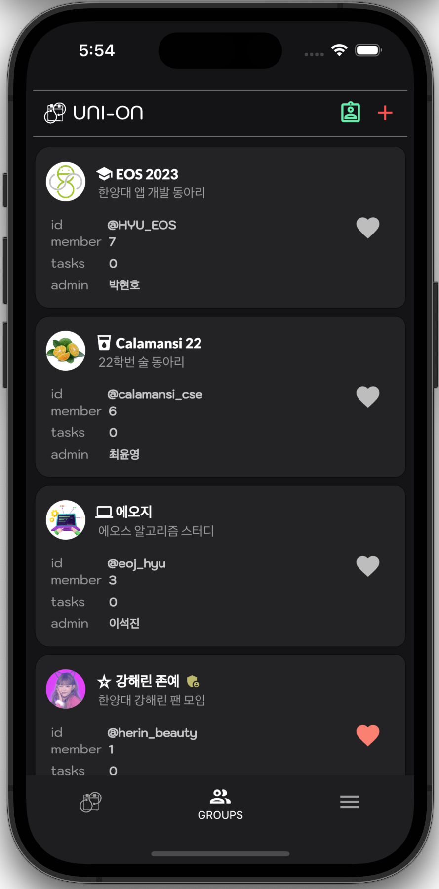

## NOTICE

한양대 컴소 에오스 2022 학술제 프로젝트 (~2022.01.28)

**This project is currently in development.**

> 추신 : 기한 맞추느라 급하게 작성해 코드가 더럽다.

#### Milestone

\*General fixes for code written in haste due to deadlines

- [ ] Organize project structure
- [ ] Combine common widgets, layout
- [ ] 기타 비동기 처리

---

 

<h1>UNI-ON</h1>
<b>A Calendar Sharing App</b> for meetings, clubs, classes, etc.

You can share schedules such as meetings, classes, and assignments, and check the other person's attendance and completion.

Works best for university(college) students.

---

### Features

A **Flutter-Firebase** project

### Built with

- [Flutter](https://flutter.dev)
- [Firebase](https://firebase.google.com)
  - Firebase Authentication, Firebase Google Authentication
  - Firebase Firestore Database
  - Firebase Storage

### Lisence overview

[License](.union/License.md)
